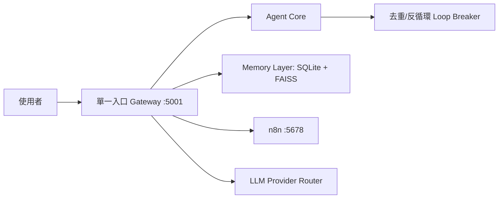

# 智能體中樞儀表板（Obsidian）

## 中樞目標
- 用一頁看到系統入口、服務健康、文件主幹與今日進度。
- 只做「導航與判斷」，不把細節塞滿這頁。

## 單一入口原則（生活化）
- `5001` 是服務台，前端請求都先走這裡。
- `n8n` 是後場流程，不跟主前端混啟動。
- 記憶層（SQLite + FAISS）是資料庫神經元，不是聊天模板。

## 關鍵技術文件
- [[ProjectDocs/dev/MAC_WINDOWS_SHARED_WORKSPACE_RUNBOOK]]
- [[ProjectDocs/dev/SINGLE_ENTRY_GATEWAY_POLICY_2026-05-25]]
- [[ProjectDocs/dev/NOTEBOOKLM_ARCH_PORT_BRANCH_REPORT_2026-05-25]]
- [[ProjectDocs/dev/CROSS_SYSTEM_LINKAGE_AND_DOC_CONSOLIDATION_2026-05-26]]

## Git 同步提醒（Vault）
- 建議主分支：`obsidian-vault-main`
- 若出現 `refusing to merge unrelated histories`，先確認遠端是否是同一歷史線再合併。

## 今日中樞導航
- [[02_MOC_單一入口與分支治理]]
- [[03_MOC_智能體關係強化與訓練分流]]
- [[04_關係圖強化操作清單]]
- [[05_MOC_架構群組_2026-05-26]]
- [[06_MOC_運維群組_2026-05-26]]
- [[07_MOC_訓練群組_2026-05-26]]
- [[08_關係圖更新紀錄_2026-05-26]]
- [[09_人工二次判讀_神經連結標籤報告_2026-05-26]]
- [[11_主程式進度與P0文件總覽_2026-05-26]]
