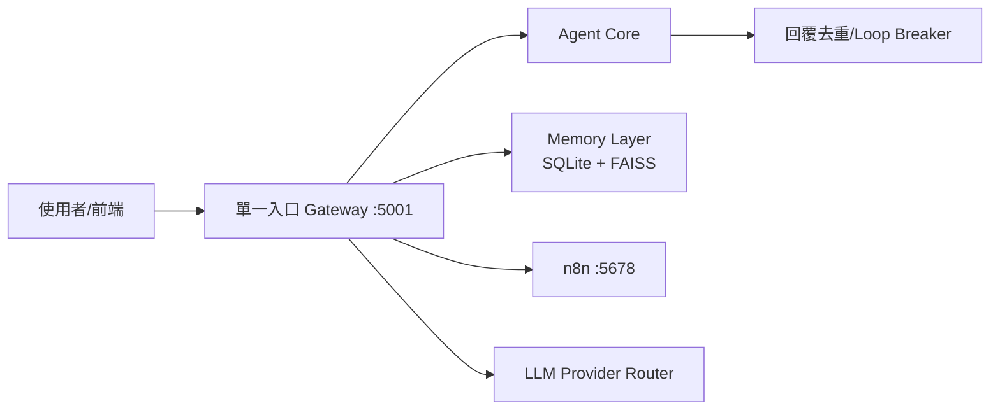

# 智能體中樞儀表板（Obsidian）

## 一眼看懂（生活化）
把整個系統想成一棟大樓：
- `5001` 是一樓總櫃台（唯一入口）
- 其他服務（n8n、記憶層、模型）是後場部門
- 前端只找總櫃台，不直接衝後場，系統就不會亂

## 今日必看文件
- [[ProjectDocs/dev/MAC_WINDOWS_SHARED_WORKSPACE_RUNBOOK]]
- [[ProjectDocs/dev/SINGLE_ENTRY_GATEWAY_POLICY_2026-05-25]]
- [[ProjectDocs/dev/NOTEBOOKLM_ARCH_PORT_BRANCH_REPORT_2026-05-25]]
- [[ProjectDocs/dev/GIT_INTEGRITY_AND_BRANCH_TRACKING_2026-05-22]]

## Git 同步（Vault 專用）
- 當前分支：`obsidian-vault-main`
- 這個分支專門給 Obsidian，不再跟 `origin/main` 互拉
- 目的：避免 `refusing to merge unrelated histories`

## 每日操作節奏
1. 開啟 Obsidian 看這頁與 Canvas。
2. 在 Vault 記錄今日變更。
3. 用 Obsidian Git 自動 commit/push 到 `obsidian-vault-main`。
4. 程式碼同步仍在專案 repo 分支進行（不要混用）。

## 新增中樞
- [[02_MOC_單一入口與分支治理]]
- [[03_MOC_智能體關係強化與訓練分流]]
- [[04_關係圖強化操作清單]]
