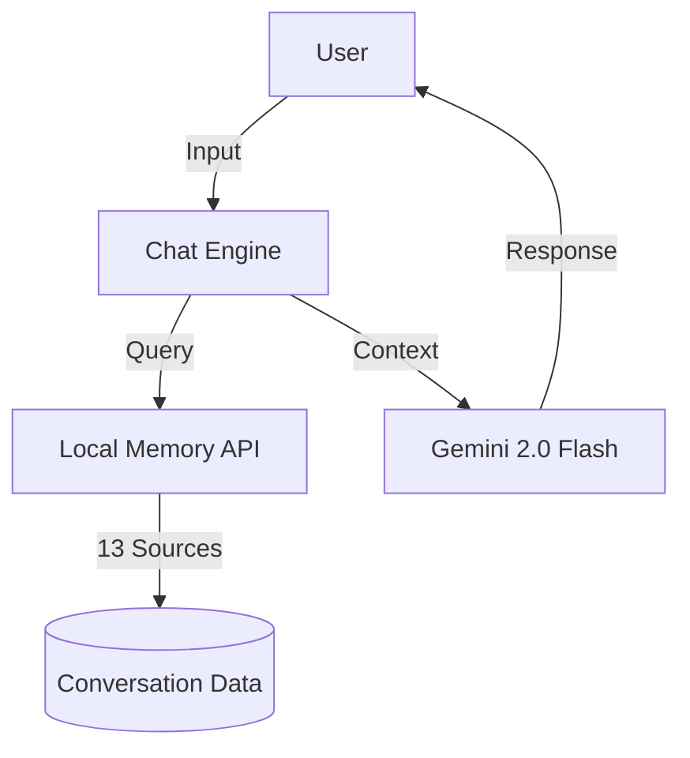

# 🏗️ 工作區架構與目錄地圖 (Architecture Map)

> **最後更新**: 2026-04-28  
> **整合自**: GETTING_STARTED, WORKSPACE_DIRECTORY_STRUCTURE, FILE_MANIFEST

---

## 🏗️ 系統層次結構

本工作區採用模組化設計，將數據、配置與執行邏輯分離：

### 1. 執行入口 (Root)

- `start_*.py`: 各類啟動腳本。
- `auto_start_chat.py`: 智慧引導腳本。
- `setup_*.py`: 環境配置腳本。

### 2. 數據與配置 (Data & Config)

- `config/`: 存放 API 密鑰與模型提示詞。
- `data/`: 存放對話歷史、消息隊列。
- `logs/`: 執行日誌與共讀記錄。

### 3. 核心大腦 (500/llama32-chat)

- `core/`: 中樞神經、聊天引擎與會話管理器。
- `agents/`: 專門處理特定任務的智能體（如代碼更新、任務追蹤）。
- `learning/`: RAG 管道、神經網絡學習邏輯。

---

## 📂 詳細目錄清單

| 目錄       | 用途                                      | 狀態      |
| :--------- | :---------------------------------------- | :-------- |
| `docs/`    | 📚 技術文檔、使用說明與架構圖。           | ✅ 已整理 |
| `tools/`   | 🔧 核心工具（API 伺服器、數據遷移工具）。 | ✅ 已整理 |
| `reports/` | 📊 系統診斷、優化報告與觀測數據。         | ✅ 已整理 |
| `demos/`   | 🎬 功能演示與集成測試腳本。               | ⚠️ 維護中 |
| `legacy/`  | 🗂️ 舊版本代碼與已整合的過時文檔。         | 📦 已歸檔 |

---

## 🧠 核心組件通信 (Communication)

---

## 🎯 開發者導航

- **修改 UI**: 編輯 `templates/chat.html` 與 `static/css/`。
- **增加記憶源**: 編輯 `tools/local_memory_api.py` 中的 `MEMORY_SOURCES`。
- **調校 AI 行為**: 編輯 `config/agent_profiles/` 下的 `.md` 提示詞文件。

---

_詳細目錄樹請參考 [WORKSPACE_DIRECTORY_STRUCTURE.md](WORKSPACE_DIRECTORY_STRUCTURE.md)_
