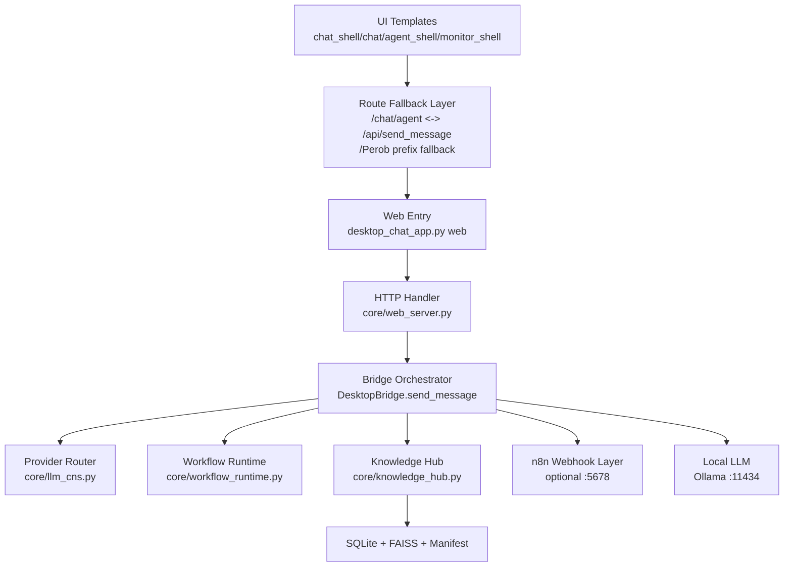

# 智能體系統：端口、回覆單一與 API 連線問題總整理（NotebookLM 版）

更新日期：2026-05-25（Asia/Taipei）

## 1) 先回答你的第一句：現在總共有幾個端口？

我把「系統全部」和「專案相關」分開算，避免誤判。

- Windows 目前 `LISTEN` 總數：`39`
- 這個專案常用/定義的端口集合：`8` 個
  - `5001, 5678, 11434, 7861, 5010, 6379, 8000, 8080`
- 目前真正有在聽的「專案相關端口」：`2` 個
  - `5001`（主 Web）
  - `11434`（Ollama）
- 目前未啟動（但應該規劃中的）端口：
  - `5678`（n8n，現在是 DOWN）
  - `7861`（debug ingest）
  - `5010`（GPT2 sidecar）
  - `6379`（Redis rate-limit backend，可選）
  - `8000/8080`（容器或替代啟動模式）

## 2) 現場狀態（實測）

- `5001` -> `python.exe desktop_chat_app.py web --host 127.0.0.1 --port 5001 --energy-lite`
- `11434` -> `ollama.exe serve`
- `5678` -> n8n watchdog 已啟動，端口已監聽（獨立於主 web）
- `5001/api/diag` -> `200`，且回報 knowledge hub `total_items=446`, `sqlite_ready=true`, `faiss_ready=true`

### 2026-05-25 二次修正結果

- 已新增 `GET /api/gateway/policy`（單一入口規範檢查）
- 已驗證以下路徑都可 `HTTP 200`：
  - `/chat/agent`
  - `/api/send_message`
  - `/api/send_message/`
  - `/Perob/chat/agent`
  - `/Perob/api/send_message`
- 目前專案相關已監聽端口：`5001, 5678, 11434`

## 3) 為什麼你會感覺「前端很容易炸」？（生活化）

把系統想成一間餐廳：

- 前台（前端）是服務生
- 廚房（後端）是出餐
- 外送平台（n8n）是加值流程
- 食材庫（SQLite + FAISS + 長期記憶）是倉庫

現在常炸的核心不是「服務生壞掉」，而是「服務生有時候走錯廚房門」。

常見情況：

- 門牌不一致：前端叫 `/chat/agent`，有些模式只吃 `/api/send_message`，就會出現 404/405。
- 同一地址多種後端模式：
  - `desktop_chat_app.py + core/web_server.py`
  - `chatgpt_server.py`
  都可能使用 `5001`，如果啟動方式混雜，前端會撞到不同回應規格。
- 反向代理前綴問題：`/Perob/...` 有時加、有時沒加，路由不一致就像「同一餐廳兩個大門但門牌不同」。
- n8n 沒常駐：主流程成功，但依賴 n8n 的延伸事件失敗，使用者感受就是「有時有、有時沒有」。

## 4) 為什麼智能體回覆會太單一？（生活化）

像你每次問不同問題，但系統先把你送進同一個「客服腳本」，結果看起來都像罐頭回答。

技術上常見原因：

- 意圖判斷過度保守：很多訊息被判成同一類，走到同一段回覆流程。
- 上下文壓縮太緊：`max_context=3`，長對話容易丟失細節，回覆就變重複模板。
- 失敗保底訊息固定：API 一出錯就回同樣風格的錯誤句。
- 後端切換過於頻繁：雲端/本地模型策略變動時，口吻容易收斂成「安全但單一」。

你這輪已經做過的改善（有效）：

- 回覆去重與反鬼打牆邏輯已加入（重複檢測 + loop breaker）
- workflow 執行條件改得更嚴格，純對話不再硬跑任務流

## 5) 主架構邏輯層（NotebookLM 可直接用）

### 5.1 UI 層

- 檔案：`templates/chat_shell.html`, `templates/chat.html`, `templates/agent_shell.html`, `templates/monitor_shell.html`
- 已加入 405 容錯：若 `/chat/agent` 405/404，會改試 `/api/send_message`，並處理 `/Perob` 前綴。

### 5.2 傳輸/路由層

- `core/web_server.py` 會正規化 `/Perob` 路徑，並接受 `/api/send_message` 與 `/chat/agent`。
- `chatgpt_server.py` 也已補齊同等 alias 路由，避免路由分岔。

### 5.3 協調層（中樞）

- `DesktopBridge.send_message` 是主回覆管線。
- 會做：意圖判斷 -> 是否進 workflow -> 模型路由 -> 回覆多樣化處理。

### 5.4 知識層

- `core/data_paths.py`：集中管理 `data/`, `manifest`, `memory.sqlite3`, `long_term.faiss`
- `core/knowledge_hub.py`：提供 status/search/rebuild，且可降級為 sqlite-only。

### 5.5 外部自動化層

- n8n 建議永遠獨立常駐於 `5678`，不要混在主 web 啟動流程。

## 6) 主分支現況（給 NotebookLM 的 Git 語境）

目前本地與遠端可見分支：

- `main`
- `codex/backend-mainline`
- `codex/db-migration-postgres`
- `codex/frontend-showcase`
- `codex/git-governance-20260517`（目前工作分支）
- `showcase-upload-20260514`

重點：

- `codex/git-governance-20260517` 最新 commit：`3aa68d7`
- 內容：前端 405 路由備援 + API alias 補強
- 相對 `origin/main`：`main` 多 4、此分支多 2（`git rev-list --left-right --count origin/main...origin/codex/git-governance-20260517`）

## 7) 為什麼「端口沒集中」會讓前端一直炸？

一句話：同一個服務名稱，背後對到不同程式，就會像同一電話轉到不同部門。

具體會炸在：

- 路由規格不同（405/404）
- 回傳 JSON 欄位不同（前端解析失敗）
- 錯誤訊息語義不同（使用者誤以為 API key 壞了）

## 8) 建議的「單一入口」規範（可直接執行）

- 只保留一個主入口：`system_main.py web --host 127.0.0.1 --port 5001 --energy-lite`
- n8n 固定走 CMD 通道：`tools/start_n8n_windows.cmd`
- Ollama 固定 `11434`
- 前端只打 `5001`，由後端做 alias/前綴兼容，不讓前端去猜

## 9) 你可以用來問 NotebookLM 的問題範例

- 「這個系統目前是 API Gateway 風格還是多入口並存風格？」
- 「若只允許單入口，哪一層最適合收斂 `/chat/agent` 與 `/api/send_message`？」
- 「在保留 n8n 獨立常駐前提下，如何做最小風險遷移？」
- 「如何在不犧牲安全的前提，提升回覆多樣性而不鬼打牆？」

## 10) 證據索引（關鍵行）

- `desktop_chat_app.py`: `--port` 預設 5001（line 1175）
- `chatgpt_server.py`: `CHAT_SERVER_PORT` 預設 5001（line 8414）
- `core/web_server.py`: 同時吃 `/api/send_message` 與 `/chat/agent`（line 379）
- `chatgpt_server.py`: `/chat/agent` 與 `/api/send_message` alias（line 6148, 6152）
- `templates/*`: 405 fallback + `E_METHOD_NOT_ALLOWED`（約 line 1876-1944 區段）
- `tools/start_main_web_windows.ps1`: 主 web 預設 port 5001（line 3）
- `tools/n8n_watchdog_windows.ps1`: n8n 預設 port 5678（line 4）
- `tools/start_n8n_windows.cmd`: `cmd /c n8n start`（line 8）

## Related Docs

- [Cross-System Linkage and Consolidation (2026-05-26)](./CROSS_SYSTEM_LINKAGE_AND_DOC_CONSOLIDATION_2026-05-26.md)
- [Single Entry Gateway Policy](./SINGLE_ENTRY_GATEWAY_POLICY_2026-05-25.md)
- [Agent Relationship Enhancement Playbook](./AGENT_RELATIONSHIP_ENHANCEMENT_PLAYBOOK_2026-05-25.md)

