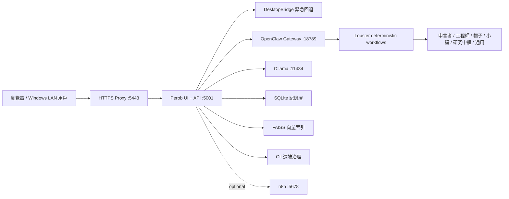

# Perob 系統框架、關係圖與進度主控報告

產生時間：2026-06-03T02:35:34

## 1. 系統摘要與已驗證真相

| 項目 | 實測結果 | 判定 |
|---|---|---|
| 正式工作區 | `/Volumes/智能體/城城城程式` | 外接硬碟為唯一正式執行工作區 |
| Git 分支 | `codex/perob-openclaw-integration-20260602` | 整合分支 |
| 本地 HEAD | `2523753` | 可追查 |
| 遠端基線 HEAD | `ed7b646` | 已保留遠端真相來源 |
| Web `5001` | `up` | 前端與 API 單一入口 |
| TLS `5443` | `up` | HTTPS 大門 |
| OpenClaw `18789` | `up` | 分階段控制平面 |
| Ollama `11434` | `up` | 本地模型回退 |
| n8n `5678` | `down` | 可選，不列入核心啟動 |
| readiness | `ready` | 必要條件：`True` |
| FAISS | `True` | 背景重建，不堵塞 Web request |
| SQLite | `True` | 記憶層可用 |

生活化理解：瀏覽器是大門，`5443` 是門禁與 TLS，`5001` 是同時負責櫃台與廚房的 Perob 主服務，`18789` 是新增的 OpenClaw 調度室。調度室故障時，廚房仍可走原生 DesktopBridge 回退路徑，不會整間餐廳停擺。

## 2. Git、工作樹與 Desktop 救援

### Git 工作樹

```text
M docs/dev/SYSTEM_FRAMEWORK_RELATIONSHIP_AND_PROGRESS_MASTER_2026-06-02.md
 M reports/AEG_SHARED_REPORT.md
 M tools/generate_system_framework_master_report.py
```

### Desktop 舊副本

| 項目 | 狀態 |
|---|---|
| `/Users/user/Desktop/城城城程式` | `已清理` |
| 已救援檔案 | `5/5` |

- `.githooks/commit-msg`
- `.githooks/pre-push`
- `docs/dev/AGENT_GIT_AUTOPILOT.md`
- `docs/dev/BRANCH_PROTECTION_POLICY.md`
- `tools/agent_git_autopilot.py`

## 3. 系統關係圖



## 4. Mac、Windows 與 LAN 相容性矩陣

| 環境 | 入口 | 狀態 | 備註 |
|---|---|---|---|
| Mac 本機 | `https://perob.com:5443/Perob` | 可用 | `/etc/hosts` 最終只保留 `127.0.0.1 perob.com` |
| Mac 除錯 | `http://127.0.0.1:5001/chat_shell` | 可用 | 跳過 TLS，適合快速確認 |
| Windows LAN | `https://<Mac-LAN-IP>:5443/Perob` | 待驗證 | 不與 Mac 本機 `perob.com` hosts 混用 |
| OpenClaw Gateway | `ws://<Mac-LAN-IP>:18789` | 需 token | LAN 模式，token 不提交 Git |
| 外接硬碟啟動 | `bash tools/manage_perob_stack.sh restart` | 可用 | 預設 Terminal-safe；LaunchAgent 需 Python 完整磁碟存取 |

## 5. Markdown 文件分層索引

| 統計 | 數量 |
|---|---:|
| Git 追蹤 MD | 177 |
| 可治理磁碟 MD | 292 |
| Git 已追蹤但磁碟缺失 | 0 |
| 已追蹤但刻意排除的 runtime MD | 6 |
| 磁碟存在但未追蹤 | 121 |

### 500/llama32-chat/docs：legacy 對照

共 `22` 筆。

- `500/llama32-chat/docs/00_文檔索引.md`
- `500/llama32-chat/docs/01_快速開始.md`
- `500/llama32-chat/docs/02_系統總覽.md`
- `500/llama32-chat/docs/03_神經系統完整指南.md`
- `500/llama32-chat/docs/04_功能介紹.md`
- `500/llama32-chat/docs/05_監測系統.md`
- `500/llama32-chat/docs/06_架構設計.md`
- `500/llama32-chat/docs/07_整合指南.md`
- `500/llama32-chat/docs/08_優化建議.md`
- `500/llama32-chat/docs/09_對話記錄使用指南.md`
- `500/llama32-chat/docs/API_KEY_SETUP_GUIDE.md`
- `500/llama32-chat/docs/LOCAL_FIRST_OPTIMAL_SOLUTION.md`
- `500/llama32-chat/docs/LOCAL_OFFLINE_GUIDE.md`
- `500/llama32-chat/docs/NEURAL_SYSTEM_COMPLETE_GUIDE.md`
- `500/llama32-chat/docs/QUICK_START_LOCAL.md`
- `500/llama32-chat/docs/QUICK_UPGRADE_GUIDE.md`
- `500/llama32-chat/docs/SYSTEM_OVERVIEW.md`
- `500/llama32-chat/docs/中文文檔完成總結.md`
- `500/llama32-chat/docs/智能體升級完成報告.md`
- `500/llama32-chat/docs/智能體實操指南.md`
- `500/llama32-chat/docs/智能體系統升級詳解.md`
- `500/llama32-chat/docs/認知能力系統使用指南.md`

### archive：歷史資料

共 `6` 筆。

- `archive/OLLAMA_API_FAILURE_DIAGNOSIS_2026-03-07.md`
- `archive/PROBLEM_RESOLUTION_CONFIRMATION_2026-03-07.md`
- `archive/QUICK_ACTION_GUIDE_2026-03-07.md`
- `archive/QUICK_TEST_GUIDE_2026-03-07.md`
- `archive/SYSTEM_DATA_UPDATE_2026-03-07.md`
- `archive/SYSTEM_RECOVERY_SUCCESS_2026-03-07.md`

### docs/dev：現行治理主幹

共 `24` 筆。

- `docs/dev/AGENT_GIT_AUTOPILOT.md`
- `docs/dev/AGENT_RELATIONSHIP_ENHANCEMENT_PLAYBOOK_2026-05-25.md`
- `docs/dev/AGENT_REPLY_OPTIMIZATION_VERIFICATION_2026-05-25.md`
- `docs/dev/ARCHITECTURE_BASELINE_AND_MD_BUNDLE_AUDIT_2026-05-27.md`
- `docs/dev/BRANCH_PROTECTION_POLICY.md`
- `docs/dev/CROSS_SYSTEM_LINKAGE_AND_DOC_CONSOLIDATION_2026-05-26.md`
- `docs/dev/DAILY_GIT_ALIGNMENT_AND_MD_OPTIMIZATION_2026-05-28.md`
- `docs/dev/DAILY_MINIMUM_GRAPH_AND_DIALOG_BACKWRITE_STANDARD_2026-05-28.md`
- `docs/dev/GITHUB_BRANCH_PROTECTION_CHECKLIST.md`
- `docs/dev/GIT_AUTONOMY_SKILL_GUIDE.md`
- `docs/dev/GIT_STAGED_DATA_SLIMMING_AUDIT_2026-05-26.md`
- `docs/dev/LLM_DEFAULT_FALLBACK_FIX_2026-05-25.md`
- `docs/dev/MAC_WINDOWS_SHARED_WORKSPACE_RUNBOOK.md`
- `docs/dev/MAIN_PROGRAM_PROGRESS_TASK_AUDIT_AND_P0_CLASSIFICATION_2026-05-26.md`
- `docs/dev/MD_BUNDLE_INDEX_2026-05-27.md`
- `docs/dev/N8N_AND_PROPHET_ENGINEER_STABILITY_REPORT_2026-05-28.md`
- `docs/dev/NOTEBOOKLM_ARCH_PORT_BRANCH_REPORT_2026-05-25.md`
- `docs/dev/SINGLE_ENTRY_GATEWAY_POLICY_2026-05-25.md`
- `docs/dev/SSD_TO_HDD_MIGRATION_AND_LAYOUT_REMEDIATION_20260517.md`
- `docs/dev/STARTUP_ENCODING_AND_STRUCTURE_HANDOFF_2026-05-27.md`
- `docs/dev/SYSTEM_FRAMEWORK_RELATIONSHIP_AND_PROGRESS_MASTER_2026-06-02.md`
- `docs/dev/TRAINING_FUSION_SCORE_ANALYSIS_2026-05-25.md`
- `docs/dev/WORKDAY_HANDOFF_PROGRESS_2026-05-28_0750.md`
- `docs/dev/reports/2026-05-14-postgres-migration-verification.md`

### docs/runbooks：可操作 SOP

共 `5` 筆。

- `docs/runbooks/cors-low-restrict-policy.md`
- `docs/runbooks/frontend-backend-route-compat.md`
- `docs/runbooks/knowledge_hub_faiss_enablement.md`
- `docs/runbooks/perob-login-gateway-stability.md`
- `docs/runbooks/startup-command-contract.md`

### reports：狀態快照與證據

共 `165` 筆。

- `reports/AEG_SHARED_REPORT.md`
- `reports/AGENT_COMMON_STATUS_20260521_151420.md`
- `reports/AGENT_COMMON_STATUS_20260521_153300.md`
- `reports/AGENT_COMMON_STATUS_20260521_155404.md`
- `reports/AGENT_COMMON_STATUS_20260521_155620.md`
- `reports/AGENT_COMMON_STATUS_20260521_161014.md`
- `reports/AGENT_COMMON_STATUS_20260521_161702.md`
- `reports/AGENT_COMMON_STATUS_20260521_CONSOLIDATED.md`
- `reports/AGENT_OPTIMIZATION_COMPLETE_REPORT.md`
- `reports/CRITICAL_SYSTEM_STATUS_2026-03-07.md`
- `reports/EYE_MOLD_MENTAL_HEALTH_PAPER_20260522.md`
- `reports/HARDWARE_UPGRADE_NEURAL_OPTIMIZATION_REPORT.md`
- `reports/IMMEDIATE_ACTION_SUMMARY_2026-03-07.md`
- `reports/INTERNAL_WORK_CONTINUATION_20260520.md`
- `reports/LOCAL_SERVER_AGENT_DIAGNOSIS_20260522.md`
- `reports/MAC_WINDOWS_STATUS_HANDOFF_20260523.md`
- `reports/MAINLINE_RAG_REPORT_20260519.md`
- `reports/MAIN_PROGRAM_FRONTEND_BACKEND_LOGIC_REVIEW_20260519.md`
- `reports/NEURAL_OPTIMIZATION_REPORT_20260307_092141.md`
- `reports/NVAPI_優化狀態報告_20260320.md`
- `reports/PROPHET_AGENT_EVALUATION_20260522.md`
- `reports/SYSTEM_ISSUE_REPORT_2026-03-07.md`
- `reports/SYSTEM_OPTIMIZATION_REPORT_2026-03-07.md`
- `reports/SYSTEM_RECOVERY_OPTIMIZATION_SUMMARY_2026-03-07.md`
- `reports/TASK_BOARD_REPAIR_20260523.md`
- `reports/WORKSPACE_ORGANIZATION_COMPLETE.md`
- `reports/WORKSPACE_ORGANIZATION_FINAL_REPORT.md`
- `reports/co_read_summary_d1_20260303.md`
- `reports/co_read_summary_d7_20260303.md`
- `reports/co_read_weekly_summary_20260303.md`
- `reports/data_summary_20260426_frontend_backend.md`
- `reports/frontend-mainline-audit-20260510.md`
- `reports/observability/latest.md`
- `reports/observability/observability_20260428_165255.md`
- `reports/observability/observability_20260428_165321.md`
- `reports/observability/observability_20260428_165414.md`
- `reports/observability/observability_20260428_170754.md`
- `reports/observability/observability_20260428_170933.md`
- `reports/observability/observability_20260428_171925.md`
- `reports/observability/observability_20260428_172041.md`
- `reports/offline_gap_training_20260318_204027.md`
- `reports/open_source_agent_research_20260319.md`
- `reports/remotasks_20260301_daily.md`
- `reports/remotasks_test_daily.md`
- `reports/remotasks_test_weekly.md`
- `reports/workflow_runs/20260324_110759_總管-workflow-report.md`
- `reports/workflow_runs/20260324_110825_總管-workflow-report.md`
- `reports/workflow_runs/20260324_111835_總管-workflow-report.md`
- `reports/workflow_runs/20260428_170904_總管-workflow-report.md`
- `reports/workflow_runs/20260428_170915_總管-workflow-report.md`
- `reports/workflow_runs/20260428_170918_總管-workflow-report.md`
- `reports/workflow_runs/20260428_170921_總管-workflow-report.md`
- `reports/workflow_runs/20260428_170925_總管-workflow-report.md`
- `reports/workflow_runs/20260428_171748_總管-workflow-report.md`
- `reports/workflow_runs/20260428_171800_總管-workflow-report.md`
- `reports/workflow_runs/20260428_171805_總管-workflow-report.md`
- `reports/workflow_runs/20260428_171807_總管-workflow-report.md`
- `reports/workflow_runs/20260428_171809_總管-workflow-report.md`
- `reports/workflow_runs/20260428_171856_總管-workflow-report.md`
- `reports/workflow_runs/20260428_171857_總管-workflow-report.md`
- `reports/workflow_runs/20260428_171901_總管-workflow-report.md`
- `reports/workflow_runs/20260428_171907_總管-workflow-report.md`
- `reports/workflow_runs/20260428_171910_總管-workflow-report.md`
- `reports/workflow_runs/20260428_171944_總管-workflow-report.md`
- `reports/workflow_runs/20260428_171945_總管-workflow-report.md`
- `reports/workflow_runs/20260428_171950_總管-workflow-report.md`
- `reports/workflow_runs/20260428_171953_總管-workflow-report.md`
- `reports/workflow_runs/20260428_171955_總管-workflow-report.md`
- `reports/workflow_runs/20260508_230139_總管-workflow-report.md`
- `reports/workflow_runs/20260508_230156_總管-workflow-report.md`
- `reports/workflow_runs/20260519_094220_總管-workflow-report.md`
- `reports/workflow_runs/20260519_210834_總管-workflow-report.md`
- `reports/workflow_runs/20260520_070621-workflow-report-engineering.md`
- `reports/workflow_runs/20260520_101044-workflow-report.md`
- `reports/workflow_runs/20260520_104927-workflow-report.md`
- `reports/workflow_runs/20260520_105134-workflow-report.md`
- `reports/workflow_runs/20260520_105229-workflow-report.md`
- `reports/workflow_runs/20260520_222835-workflow-report.md`
- `reports/workflow_runs/20260521_151427-workflow-report.md`
- `reports/workflow_runs/20260521_151429-workflow-report.md`

### 其他：待逐步整理

共 `70` 筆。

- `.github/pull_request_template.md`
- `500/llama32-chat/README.md`
- `GEMINI.md`
- `README.md`
- `WORKSPACE_DIRECTORY_STRUCTURE.md`
- `brain-spirit-guide/references/knowledge_deep_dive.md`
- `config/agent_profiles/global_chatgpt_prompt.md`
- `config/agent_profiles/prophet_prompt.md`
- `config/agent_profiles/synced_chatgpt_custom_instructions.md`
- `cursor-agent-sidebar-extension/README.md`
- `docs/AGENT_SYSTEM_GUIDE.md`
- `docs/AGENT_UPGRADE_READY.md`
- `docs/DATA_LAYER_SOURCE_OF_TRUTH.md`
- `docs/DATA_TRACKING_TIERS.md`
- `docs/DESKTOP_CHAT_OPTIMIZATION_GUIDE.md`
- `docs/GEMINI_SETUP_GUIDE.md`
- `docs/LEARNING_SESSION_PROGRESS.md`
- `docs/MODEL_OPTIMIZATION_GUIDE.md`
- `docs/README_SESSION_DATA_MANAGEMENT.md`
- `docs/README_UNIFIED_LEARNING.md`
- `docs/Remotasks商業運營系統完整交付.md`
- `docs/Remotasks收益啟動指南.md`
- `docs/Remotasks自動週報使用說明.md`
- `docs/SYSTEM_ARCHITECTURE_MAP.md`
- `docs/SYSTEM_SETUP_AND_LAUNCH.md`
- `docs/SYSTEM_VERIFICATION_REPORT.md`
- `docs/UNIFIED_LEARNING_SUMMARY.md`
- `docs/WORKSPACE_ORGANIZATION_PLAN.md`
- `docs/WORKSPACE_ORGANIZATION_SUMMARY.md`
- `docs/agent_v1/README.md`
- `docs/ooschool_live_sync_steps.md`
- `docs/中期改進_快速指南.md`
- `docs/優化摘要.md`
- `docs/學習系統說明.md`
- `docs/實作摘要.md`
- `docs/履歷使用指南.md`
- `docs/工程師交接_控制面板與實境監控_2026-04-11.md`
- `docs/快速參考.md`
- `docs/效能維護手冊.md`
- `docs/智能體功能對應圖.md`
- `docs/智能體升級完成報告_英文版.md`
- `docs/智能體實務指南.md`
- `docs/智能體快速啟動.md`
- `docs/智能體快速啟動_英文版.md`
- `docs/智能體系統升級_v1_英文版.md`
- `docs/智能體能力強化路線圖.md`
- `docs/本地記憶API使用指南.md`
- `docs/桌面聊天使用說明.md`
- `docs/檔案清單總覽.md`
- `docs/檔案系統學習說明.md`
- `docs/終端機快速操作_智能體控制台失靈救援.md`
- `docs/網狀語言比對_進度回報_2026-04-11.md`
- `docs/聊天系統說明.md`
- `docs/自適應神經成長系統_README.md`
- `docs/自適應神經成長系統指南.md`
- `docs/連續自主學習使用指南.md`
- `docs/開源參考路線圖.md`
- `skills/brain-spirit-guide/SKILL.md`
- `skills/brain-spirit-guide/references/domain_map.md`
- `skills/brain-spirit-guide/references/example_reference.md`
- `skills/memory-retriever/SKILL.md`
- `skills/traffic-optimizer/SKILL.md`
- `skills/workspace-butler/SKILL.md`
- `skills_dev/coding-master/SKILL.md`
- `skills_dev/coding-master/references/collaboration.md`
- `skills_dev/coding-master/references/engineering_standards.md`
- `skills_dev/coding-master/references/example_reference.md`
- `skills_dev/coding-master/references/workflows.md`
- `陳品瑜_履歷.md`
- `陳品瑜_平台申請簡歷.md`

### Git 已追蹤但磁碟缺失

- 無

### 已追蹤但刻意排除的 runtime MD

- `.gemini/skills/brain-spirit-guide/SKILL.md`
- `.gemini/skills/brain-spirit-guide/references/domain_map.md`
- `.gemini/skills/brain-spirit-guide/references/example_reference.md`
- `.gemini/skills/memory-retriever/SKILL.md`
- `.gemini/skills/traffic-optimizer/SKILL.md`
- `.gemini/skills/workspace-butler/SKILL.md`

### 磁碟存在但未追蹤

- `reports/observability/latest.md`
- `reports/observability/observability_20260428_165255.md`
- `reports/observability/observability_20260428_165321.md`
- `reports/observability/observability_20260428_165414.md`
- `reports/observability/observability_20260428_170754.md`
- `reports/observability/observability_20260428_170933.md`
- `reports/observability/observability_20260428_171925.md`
- `reports/observability/observability_20260428_172041.md`
- `reports/workflow_runs/20260324_110759_總管-workflow-report.md`
- `reports/workflow_runs/20260324_110825_總管-workflow-report.md`
- `reports/workflow_runs/20260324_111835_總管-workflow-report.md`
- `reports/workflow_runs/20260428_170904_總管-workflow-report.md`
- `reports/workflow_runs/20260428_170915_總管-workflow-report.md`
- `reports/workflow_runs/20260428_170918_總管-workflow-report.md`
- `reports/workflow_runs/20260428_170921_總管-workflow-report.md`
- `reports/workflow_runs/20260428_170925_總管-workflow-report.md`
- `reports/workflow_runs/20260428_171748_總管-workflow-report.md`
- `reports/workflow_runs/20260428_171800_總管-workflow-report.md`
- `reports/workflow_runs/20260428_171805_總管-workflow-report.md`
- `reports/workflow_runs/20260428_171807_總管-workflow-report.md`
- `reports/workflow_runs/20260428_171809_總管-workflow-report.md`
- `reports/workflow_runs/20260428_171856_總管-workflow-report.md`
- `reports/workflow_runs/20260428_171857_總管-workflow-report.md`
- `reports/workflow_runs/20260428_171901_總管-workflow-report.md`
- `reports/workflow_runs/20260428_171907_總管-workflow-report.md`
- `reports/workflow_runs/20260428_171910_總管-workflow-report.md`
- `reports/workflow_runs/20260428_171944_總管-workflow-report.md`
- `reports/workflow_runs/20260428_171945_總管-workflow-report.md`
- `reports/workflow_runs/20260428_171950_總管-workflow-report.md`
- `reports/workflow_runs/20260428_171953_總管-workflow-report.md`
- `reports/workflow_runs/20260428_171955_總管-workflow-report.md`
- `reports/workflow_runs/20260508_230139_總管-workflow-report.md`
- `reports/workflow_runs/20260508_230156_總管-workflow-report.md`
- `reports/workflow_runs/20260519_094220_總管-workflow-report.md`
- `reports/workflow_runs/20260519_210834_總管-workflow-report.md`
- `reports/workflow_runs/20260520_070621-workflow-report-engineering.md`
- `reports/workflow_runs/20260520_101044-workflow-report.md`
- `reports/workflow_runs/20260520_104927-workflow-report.md`
- `reports/workflow_runs/20260520_105134-workflow-report.md`
- `reports/workflow_runs/20260520_105229-workflow-report.md`
- `reports/workflow_runs/20260520_222835-workflow-report.md`
- `reports/workflow_runs/20260521_151427-workflow-report.md`
- `reports/workflow_runs/20260521_151429-workflow-report.md`
- `reports/workflow_runs/20260521_151430-workflow-report.md`
- `reports/workflow_runs/20260521_151431-workflow-report.md`
- `reports/workflow_runs/20260521_151432-workflow-report.md`
- `reports/workflow_runs/20260521_151434-workflow-report.md`
- `reports/workflow_runs/20260521_151435-workflow-report.md`
- `reports/workflow_runs/20260521_153307-workflow-report.md`
- `reports/workflow_runs/20260521_153309-workflow-report.md`
- `reports/workflow_runs/20260521_153310-workflow-report.md`
- `reports/workflow_runs/20260521_153311-workflow-report.md`
- `reports/workflow_runs/20260521_153313-workflow-report.md`
- `reports/workflow_runs/20260521_153314-workflow-report.md`
- `reports/workflow_runs/20260521_153315-workflow-report.md`
- `reports/workflow_runs/20260521_153732-workflow-report.md`
- `reports/workflow_runs/20260521_155414-workflow-report.md`
- `reports/workflow_runs/20260521_155416-workflow-report.md`
- `reports/workflow_runs/20260521_155419-workflow-report.md`
- `reports/workflow_runs/20260521_155420-workflow-report.md`
- `reports/workflow_runs/20260521_155421-workflow-report.md`
- `reports/workflow_runs/20260521_155423-workflow-report.md`
- `reports/workflow_runs/20260521_155424-workflow-report.md`
- `reports/workflow_runs/20260521_155635-workflow-report.md`
- `reports/workflow_runs/20260521_155637-workflow-report.md`
- `reports/workflow_runs/20260521_155638-workflow-report.md`
- `reports/workflow_runs/20260521_155639-workflow-report.md`
- `reports/workflow_runs/20260521_155641-workflow-report.md`
- `reports/workflow_runs/20260521_155642-workflow-report.md`
- `reports/workflow_runs/20260521_155644-workflow-report.md`
- `reports/workflow_runs/20260521_161025-workflow-report.md`
- `reports/workflow_runs/20260521_161026-workflow-report.md`
- `reports/workflow_runs/20260521_161028-workflow-report.md`
- `reports/workflow_runs/20260521_161029-workflow-report.md`
- `reports/workflow_runs/20260521_161033-workflow-report.md`
- `reports/workflow_runs/20260521_161034-workflow-report.md`
- `reports/workflow_runs/20260521_161036-workflow-report.md`
- `reports/workflow_runs/20260521_161722-workflow-report.md`
- `reports/workflow_runs/20260521_161724-workflow-report.md`
- `reports/workflow_runs/20260521_161726-workflow-report.md`
- `reports/workflow_runs/20260521_161728-workflow-report.md`
- `reports/workflow_runs/20260521_161730-workflow-report.md`
- `reports/workflow_runs/20260521_161732-workflow-report.md`
- `reports/workflow_runs/20260521_161734-workflow-report.md`
- `reports/workflow_runs/20260521_171929-workflow-report-research.md`
- `reports/workflow_runs/20260521_182351-workflow-report-research.md`
- `reports/workflow_runs/20260522_080411-workflow-report.md`
- `reports/workflow_runs/20260522_115611-workflow-report.md`
- `reports/workflow_runs/20260522_204502-workflow-report-engineering.md`
- `reports/workflow_runs/20260522_211812-workflow-report.md`
- `reports/workflow_runs/20260522_211928-workflow-report.md`
- `reports/workflow_runs/20260522_211939-workflow-report.md`
- `reports/workflow_runs/20260522_212016-workflow-report.md`
- `reports/workflow_runs/20260523_061851-workflow-report.md`
- `reports/workflow_runs/20260523_061920-workflow-report.md`
- `reports/workflow_runs/20260523_062754-workflow-report.md`
- `reports/workflow_runs/20260523_063012-workflow-report.md`
- `reports/workflow_runs/20260523_064130-workflow-report.md`
- `reports/workflow_runs/20260523_064155-workflow-report.md`
- `reports/workflow_runs/20260523_064255-workflow-report.md`
- `reports/workflow_runs/20260523_064346-workflow-report.md`
- `reports/workflow_runs/20260523_065106-workflow-report.md`
- `reports/workflow_runs/20260523_071917-workflow-report.md`
- `reports/workflow_runs/20260523_071932-workflow-report.md`
- `reports/workflow_runs/20260523_071959-workflow-report.md`
- `reports/workflow_runs/20260523_073504-workflow-report.md`
- `reports/workflow_runs/20260523_110159-workflow-report.md`
- `reports/workflow_runs/20260523_110206-workflow-report.md`
- `reports/workflow_runs/20260523_110904-workflow-report.md`
- `reports/workflow_runs/20260523_111130-workflow-report.md`
- `reports/workflow_runs/20260523_111448-workflow-report.md`
- `reports/workflow_runs/20260523_111537-workflow-report.md`
- `reports/workflow_runs/20260523_113019-workflow-report.md`
- `reports/workflow_runs/20260528_110036-workflow-report.md`
- `reports/workflow_runs/20260528_110249-workflow-report.md`
- `reports/workflow_runs/20260528_111610-workflow-report.md`
- `reports/workflow_runs/20260528_111928-workflow-report.md`
- `reports/workflow_runs/20260529_102156-workflow-report.md`
- `reports/workflow_runs/20260529_102353-workflow-report.md`
- `reports/workflow_runs/20260529_102703-workflow-report.md`

## 6. 統一進度表

| 模組 | 目前狀態 | 完成條件 |
|---|---|---|
| Git 對齊 | 整合分支 `codex/perob-openclaw-integration-20260602` 已建立 | 完整驗證後推送遠端 |
| Desktop 舊版 | 已救援 `5` 筆附件 | checksum 驗證、推送後刪除 |
| Web `5001` | `connected` | live 與 ready 均通過 |
| TLS `5443` | `ready` | `/Perob` HEAD/GET 均導向 `/chat_shell` |
| OpenClaw `18789` | `connected` | Gateway token、RPC 與 Lobster allowlist 通過 |
| Lobster | allowlist 已要求啟用 | 加入高風險 approval workflow 實測 |
| FAISS | `True` | manifest 使用可攜路徑 |
| Workflow rerun | HTTP 路由已補齊 | 前端帶有效 task id 重跑通過 |
| 診斷工具 | 已移除 legacy 誤報 | 持續監控趨勢與 swap |
| hosts | 仍需人工授權正規化 | 只保留本機 `127.0.0.1 perob.com` |

## 7. 風險排名與下一階段 backlog

| 優先級 | 風險 | 下一步 |
|---|---|---|
| P1 | `/etc/hosts` 同時存在 LAN IP 與 localhost | 執行 `bash tools/normalize_perob_hosts.sh`，依提示使用一次 sudo |
| P1 | 外接卷宗下 LaunchAgent 受 macOS TCC 限制 | 保留 Terminal-safe 模式；若要 daemon 化，授予 Python 完整磁碟存取後再開 `PEROB_USE_LAUNCHAGENT=1` |
| P2 | OpenClaw 任務轉送尚未設定 endpoint | 先維持 adapter 健康狀態與 DesktopBridge 回退，再做 approval workflow |
| P2 | n8n 未啟動 | 保持可選，不混入核心登入鏈 |
| P2 | 歷史工作流含失敗紀錄 | 以有效 task id 實測 rerun，逐步清理 |
| P3 | Markdown 文件仍有歷史散件 | 持續以本 generator 分類，不直接批次刪除 |

## 8. 可重跑驗證指令

```bash
cd "/Volumes/智能體/城城城程式"
python3 tools/generate_system_framework_master_report.py
python3 -m py_compile core/web_server.py core/openclaw_adapter.py core/knowledge_hub.py desktop_chat_app.py chatgpt_server.py SYSTEM_DIAGNOSTIC.py
python3 -m unittest tests.test_perob_mainline_health_contract -v
curl -sS http://127.0.0.1:5001/health/live
curl -sS http://127.0.0.1:5001/health/ready
curl -k --resolve perob.com:5443:127.0.0.1 https://perob.com:5443/status
openclaw gateway status --json
```
