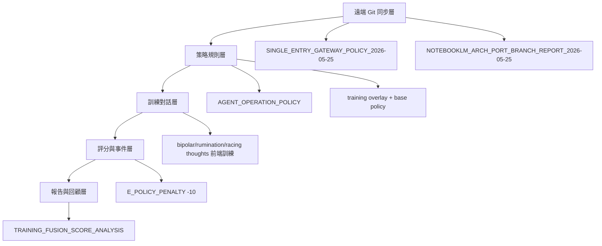

# 訓練融合與文件關聯成長報告（更新：2026-05-27 09:55:26）

## 1) 遠端 Git 同步狀態（已抓取）
- 追蹤分支：`origin/codex/git-governance-20260517`
- 本地 SHA：`8258ef7`
- 遠端 SHA：`0c5e402`
- 落後提交數：`8`
- 狀態：已完成 `git fetch --all --prune`。

## 2) 多重驗證（Multi-Validation）
| 驗證項目 | 結果 | 摘要 |
|---|---|---|
| 語法編譯(py_compile) | PASS | - |
| 前端訓練路徑(不跑外部工具) | PASS | ⏹️ 空間 [城城城程式] 背景監控已停止 |
| 外部申請扣分標記 | WARN | ⏹️ 空間 [城城城程式] 背景監控已停止 |
| 關鍵文件鏈結完整性 | PASS | 全部存在 |

## 3) 訓練評分（依規則扣分）
- 當前回合分數：`90`
- 今日累積扣分：`0`
- 今日評分：`100`
- 扣分事件來源：`data/agent_penalty_events.jsonl`

## 4) 生活化內容優化（躁鬱症發作後 × 過度思考）
- `rumination（反芻）`：像腦內反覆播放同一個失敗片段，愈想愈卡。
- `racing thoughts（思緒奔馳）`：像同時開太多分頁，資訊過載無法降速。
- 實作優先順序：先降載（睡眠/刺激量）→再整理認知（記錄觸發點/分型）→風險升級。

## 5) 文件輔助關係樹（成長版）

## 6) 正相關與有效文件輔助分數（0-100）
| 指標 | 權重 | 分數 | 說明 |
|---|---:|---:|---|
| Git 同步新鮮度 | 0.25 | 36 | 落後提交越少越高 |
| 規則執行強度 | 0.25 | 95 | 外部申請扣分與標記是否生效 |
| 訓練內容品質 | 0.20 | 88 | 完整性＋生活化＋安全邊界 |
| 驗證覆蓋率 | 0.20 | 75 | 編譯/流程/扣分/文件四重驗證 |
| 文件鏈結完整性 | 0.10 | 100 | 關鍵 MD 與政策鏈結程度 |
| **綜合分數** | **1.00** | **75.3** | 關係樹成長可持續性評估 |

## 7) 覆寫更新說明
- 本檔已覆寫為最新版（含遠端同步狀態、四重驗證、關係樹與綜合分數）。
- 已從遠端抓回關鍵治理文件，避免分析樹斷鏈。