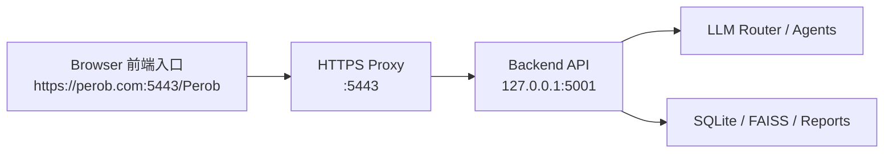

# Perob 登入入口穩定度 Runbook（Git 對齊版）

更新日期：2026-05-29  
適用目標：快速啟動「前端大門 + 後端廚房 + HTTPS 入口」並降低 `ERR_CONNECTION_REFUSED`

## 1) 核心結論（先看這段）

`https://perob.com:5443/Perob` 無法開啟時，最常見根因不是程式壞掉，而是三層其中一層中斷：

1. DNS/Host 沒把 `perob.com` 指到本機（127.0.0.1）
2. HTTPS 代理 `5443` 沒在聽
3. 後端 API `5001` 沒在聽

本文件把這三層固定化成「登入前 60 秒檢查」與「一鍵重啟流程」。

## 2) 前後端關係（入口處理流程）



重點：
- 前端畫面只是入口，實際回應要靠 `5001`。
- `5443` 只是 HTTPS 門面，內部轉發到 `5001`。

## 3) Git 對齊規範（登入前）

```bash
cd /Volumes/智能體/城城城程式
git fetch origin
git status -sb
```

判讀：
- `behind`：先 `git pull --rebase` 再開服務。
- 工作樹有修改（`M`）：先確認是否要保留，不要盲目覆蓋。

## 4) 60 秒健康檢查（標準）

```bash
# A. 後端
curl -sS -m 4 http://127.0.0.1:5001/status

# B. HTTPS 代理（強制走本機）
curl -k -sS -m 6 --resolve perob.com:5443:127.0.0.1 \
  https://perob.com:5443/status

# C. 入口路由
curl -k -I -m 6 --resolve perob.com:5443:127.0.0.1 \
  https://perob.com:5443/Perob
```

預期：
- A/B 都回 `{"ok": true, ...}`
- C 回 `302` 並導向 `/chat_shell`

## 5) 快速啟動（建議固定用）

```bash
cd /Volumes/智能體/城城城程式
bash tools/manage_perob_stack.sh restart
```

補充：
- 這個指令會重啟後端、HTTPS 代理與前端代理服務（LaunchAgent 管理）。
- 如果你只想看狀態：`bash tools/manage_perob_stack.sh status`

## 6) 若出現 `ERR_CONNECTION_REFUSED`（分流）

### Step 1：看 port 是否在聽
```bash
lsof -nP -iTCP:5001 -sTCP:LISTEN
lsof -nP -iTCP:5443 -sTCP:LISTEN
```

### Step 2：若 `5001` 沒在聽
```bash
cd /Volumes/智能體/城城城程式
python3 desktop_chat_app.py web --host 127.0.0.1 --port 5001 --energy-lite
```

### Step 3：若 `5443` 沒在聽
```bash
cd /Volumes/智能體/城城城程式
python3 tools/https_local_proxy.py \
  --listen-host 0.0.0.0 \
  --listen-port 5443 \
  --upstream-host 127.0.0.1 \
  --upstream-port 5001 \
  --certfile certs/local-https.crt \
  --keyfile certs/local-https.key \
  --external-https-base https://perob.com:5443
```

### Step 4：若 `--resolve` 成功但瀏覽器失敗
這表示 `perob.com` 沒正確指到本機（DNS/hosts 問題），不是應用本身壞掉。

## 7) 登入入口策略（之後固定照這份）

1. 先 `git fetch` 對齊資料狀態。
2. 再跑 60 秒健康檢查。
3. 檢查通過後才開瀏覽器入口。
4. 出現錯誤一律先查 `5001/5443`，最後才查 UI。

## 8) 最小維運指令清單（可直接貼）

```bash
cd /Volumes/智能體/城城城程式
git fetch origin
git status -sb
bash tools/manage_perob_stack.sh restart
curl -sS http://127.0.0.1:5001/status
curl -k -sS --resolve perob.com:5443:127.0.0.1 https://perob.com:5443/status
```

## 9) 目標成效（本文件用途）

- 登入開啟前後端與伺服器所需時間：壓到 1~2 分鐘
- 故障定位：從「猜問題」改成「三層分流」
- 後續交接：以此文件為單一入口標準，不再散落多版本口訣
