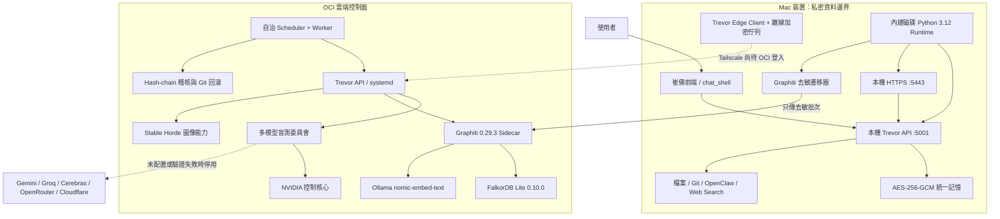

<!-- markdownlint-configure-file
{
  "MD013": {
    "line_length": 120,
    "tables": false
  },
  "MD060": {
    "style": "compact"
  }
}
-->

# 崔佛框架即時狀態總覽

- 產生時間：2026-08-25 04:12 CST
- 對外身份：`trevor／崔佛`
- 本次 GitHub review 修正起點：`bdeacd6815b4`
- 整體狀態：核心服務可用；Graphiti 歷史記憶遷移暫停以修復安全分片；OCI Tailscale 等待帳戶實體驗證
- 安全狀態：GitHub Dependabot 開啟警示 `0`、Secret Scanning 開啟警示 `0`

## 狀態圖例

| 標記 | 意義 |
| --- | --- |
| ✅ | 已完成、已有測試或線上驗證 |
| 🟢 | 目前正在正常執行 |
| 🟡 | 功能已實作，仍在遷移、shadow rollout 或最終驗收 |
| 🟠 | 受外部帳戶、配額或實體驗證阻塞 |
| ⚪ | 可選功能；未配置時不影響核心服務 |

## 現行架構圖



## 框架總表

| 框架 | 現在負責什麼 | 狀態 | 已做到 | 還要做 |
| --- | --- | --- | --- | --- |
| 崔佛身份層 | 統一所有舊智能體身份與能力模式 | ✅ | API、前端、任務與能力登記只公開 `trevor／崔佛`；舊角色正規化並警告棄用 | 下一個 schema 版本移除舊別名 |
| Trevor API | 對話、狀態、Provider、任務與能力入口 | 🟢 | 本機與 OCI health 正常；身份、審議資訊與去敏 Provider 狀態已公開 | OCI 重開機後再跑完整 E2E |
| 前端 / chat shell | 單一崔佛介面、能力模式、文字與圖像操作 | 🟢 | 本機 `5001` 與 `5443` 已恢復；前端與 backend readiness 正常 | 經 Tailscale 驗證 OCI 遠端入口 |
| Provider Registry | 模型憑證、健康度、免費政策、熔斷與降級 | ✅ | NVIDIA 不再借用 `OPENAI_API_KEY`；各 Provider 獨立憑證與狀態 | 新增有效的外部免費 Provider 金鑰 |
| 多模型委員會 | `fast`、`cross_check`、`rigorous` 盲測與仲裁 | 🟡 | 評分、硬門檻、去敏、禁止工具與記憶權限已實作；目前 shadow rollout | 目前只有 NVIDIA 可用；外部席位未齊前會安全降級 |
| NVIDIA 控制核心 | 工具、自治、記憶寫入與 Git 控制權 | 🟢 | 主系統預設 Ultra；Graphiti 遷移暫用 Nano 並關閉 thinking | 遷移完成後把 Graphiti 恢復 Ultra／90 秒正式設定 |
| Web Search | 即時搜尋與來源摘要能力 | ✅ | 搜尋 adapter、真實能力回覆與測試已完成 | OCI Tailscale E2E 驗證 |
| Stable Horde | 後端圖像生成，避免瀏覽器持有金鑰 | 🟡 | API 金鑰已移出 `.env` 並放入私密 credential file；後端能力已整合 | OCI 重開機後跑圖像生成 E2E |
| 統一記憶 | 保存對話、偏好、任務與裝置私密資料 | ✅ | 1,427 個 thread、5,426 筆 turn 已統一；AES-256-GCM、雜湊去重與可重跑遷移已完成 | 僅剩 Graphiti 雲端去敏索引尚未全部寫完 |
| 記憶衝突解析 | 防止舊角色、舊偏好與新指令互相衝突 | ✅ | 限制性安全值優先，再比較來源順位、記錄 priority，最後才依 `updated_at`；保留 `source_role` | 持續以新記憶事件驗證衝突規則 |
| Graphiti Sidecar | 時序知識圖、關係、偏好與任務摘要 | 🟢 | `Graphiti 0.29.3`、`FalkorDB Lite 0.10.0`、NVIDIA extraction、Ollama embedding 均在線 | 完成剩餘 2,768 筆 turn 遷移與搜尋驗收 |
| FalkorDB | Graphiti 私有圖資料庫 | 🟢 | 僅綁定 OCI loopback；低併發查詢、序列化寫入、平台模組校驗已完成 | 遷移完成後做快照與重開機恢復測試 |
| Ollama Embedding | `nomic-embed-text` 向量嵌入 | 🟢 | OCI `ollama` systemd active；Graphiti health 已確認 | 重開機後確認模型仍存在且可嵌入 |
| 自治 Scheduler | 每 15 分鐘評估工作與暫停條件 | 🟢 | OCI scheduler heartbeat 正常；單任務限制與安全政策已實作 | shadow 驗收後逐步開啟更多自治任務 |
| 自治 Worker | 隔離執行修復、測試與小功能 | 🟢 | OCI worker active；lease、worktree、秘密阻擋與稽核已有測試 | 以正式小任務完成重開機後驗收 |
| Git 整合流程 | task → integration → main、required CI、auto-merge | ✅ | PR #12 已由 task 合併 integration；PR #13 已經 required CI 後 merge-commit 至 main | 最終 OCI 安裝完成後記錄部署事件 |
| Hash-chain Audit | 部署、模型、權限、遷移、Git 與回滾稽核 | ✅ | 本機與 OCI hash chain 都已驗證完整 | 遷移完成、正式安裝與回滾快照要追加事件 |
| OCI systemd | API、Graphiti、Autonomy、Worker、Ollama 常駐 | 🟢 | 五個服務目前 active；Trevor target 已 enable | 使用最新 main 跑正式 installer，之後重開機驗證 |
| Mac 內建 runtime | 避免外接卷卸載讓 Python 崩潰 | ✅ | Python 3.12、完整 app 與遷移快照已搬到內建磁碟；本機服務由 launchd KeepAlive | 最終 main 更新後重建一次 runtime 快照 |
| Tailscale 私網 | Mac 與 OCI 的唯一遠端 API 網路 | 🟠 | Mac 已登入；API 仍只綁定 loopback，不公開 Internet | OCI 顯示 `NeedsLogin`，必須完成帳戶實體 OAuth／passkey 驗證 |
| Secret / Auth | credential files、API HMAC、Keychain 非互動讀取 | ✅ | `.env.example` 全為假值；Mac 目錄 `0700`、檔案 `0400`；OCI 目錄 root-only；不再跳 Keychain 密碼視窗 | 重開機成功後移除舊 RSA recovery SSH key |
| 回滾 / 快照 | Git revert、資料快照與設定恢復 | 🟡 | Git 禁止 force reset；Graphiti 遷移前 env 快照存在；OCI installer 已改為 staging release 與失敗自動回滾 | 遷移完成後建立 FalkorDB／資料快照並驗證還原 |

## 技術框架與程式基座

| 技術 | 現在負責什麼 | 狀態 | 實測或使用方式 |
| --- | --- | --- | --- |
| Python 3.12 | 崔佛主程式、工具、遷移器與測試基準 | 🟢 | Mac 改由內建磁碟 runtime 執行；Graphiti 使用隔離的 Python 3.12 sidecar |
| Flask 3 | 本機 Trevor API、chat shell、health 與舊入口相容層 | 🟢 | `5001` live／ready 均通過，required readiness 為 `true` |
| FastAPI | Graphiti 私有 sidecar API | 🟢 | 僅存在 Graphiti 隔離環境；OCI `trevor-graphiti` active，不混入桌面主環境 |
| pywebview | Mac／Windows 桌面殼與 JavaScript bridge | ✅ | 套件可用；瀏覽器與桌面殼共用同一套 chat shell／backend API |
| 原生 HTML／CSS／JavaScript | 崔佛前端與能力操作介面 | 🟢 | 無 Node build 依賴；由 Flask templates／static 直接提供 |
| LangGraph | 按需執行工具工作流、狀態節點與結果整合 | ✅ | 主 Python 3.12 環境可匯入；runtime capability guard 會依真實狀態回覆 |
| LangChain | 部分模型／工作流相容層 | ⚪ | 套件可用，但不是控制核心；不持有自治或 Git 權限 |
| AutoGen | 預留的多智能體相容依賴 | ⚪ | requirements 已保留，目前正式程式沒有直接匯入，避免再次產生多重人格控制面 |
| Pydantic 2 | API、Provider、任務與 sidecar schema 驗證 | ✅ | 主環境可用；公開回應固定身份與結構化審議欄位 |
| HTTPX／Tenacity | Provider HTTP、timeout、有限重試與故障降級 | ✅ | Provider 連線按家隔離；付費或憑證失敗時 fail closed |
| SQLite／FAISS | 裝置知識庫、精確資料與向量檢索 | 🟢 | readiness 顯示兩者均 ready；目前 Knowledge Hub 共 `2,841` 筆 |
| Cryptography | AES-256-GCM 私密資料與離線佇列加密 | ✅ | 原始對話與私密資料留在裝置；OCI 只接收去敏資料 |
| Graphiti／FalkorDB／Ollama | 時序知識圖、圖查詢與 embedding | 🟡 | 三項服務在線；歷史資料 checkpoint 為 `2,658／5,426` |
| launchd／systemd | Mac 與 OCI 常駐、KeepAlive、重啟與依賴順序 | 🟢 | Mac 兩個 LaunchAgent running；OCI 五個服務 active |

## 目前實際執行狀態

### Mac

| 項目 | 狀態 |
| --- | --- |
| `com.user.perob-backend` | `running`，由 launchd KeepAlive 管理 |
| `com.user.perob-https` | `running`，由 launchd KeepAlive 管理 |
| Backend health | `connected` |
| Backend readiness | `ready`，無核心 degraded reason |
| 執行位置 | `~/Library/Application Support/Trevor/runtime/app-main-*` |
| 私密資料 | `~/Library/Application Support/Trevor`，不寫入 Git 工作樹 |
| Graphiti migrator | 已安全停止；checkpoint 已落盤，等待 deterministic 安全分片修正 |

### OCI

| 服務 | 狀態 |
| --- | --- |
| `trevor-api` | `active` |
| `trevor-graphiti` | `active` |
| `trevor-autonomy` | `active` |
| `trevor-worker` | `active` |
| `ollama` | `active` |
| Graphiti extraction | `nvidia/nemotron-3-nano-30b-a3b`，thinking disabled |
| Graphiti migration timeout | 暫時 `240` 秒；完成後恢復 `90` 秒 |
| Tailscale | `NeedsLogin` |
| 應用程式 | `/opt/trevor/app` |
| 執行資料 | `/var/lib/trevor` |
| 憑證 | `/etc/trevor/credentials`，root-only |

## Graphiti 遷移進度

```text
總 turn：       5,426
已 checkpoint：2,658
剩餘：          2,768
完成率：        49.0%
程序：          stopped，等待安全分片修正
stderr：        0 bytes
```

目前已完成的遷移保護：

1. 先去敏，再傳送到 OCI。
2. thread ID 只送 SHA-256 短參照。
3. 每批使用 deterministic UUID，重跑不製造假新 episode。
4. 成功後立即 `fsync` checkpoint；中斷後從最後成功點續跑。
5. 固定依時間排序，避免不同重跑順序造成行為衝突。
6. 原始對話、附件、私密筆記與完整 content hash manifest 不上傳 OCI。

安全分片修正：

- 24-turn 大批次可能讓 NVIDIA 輸出超過完整 JSON 長度，Graphiti 解析時得到截斷 JSON。
- 邏輯批次維持 24-turn identity；完全未完成批次改以最多 8-turn／14,000 bytes deterministic 子批次上傳。
- 每個成功子批次先 `fsync` upload journal，再寫 turn checkpoint；中途崩潰也不會改用另一個 episode UUID。
- 舊版混合 checkpoint 仍重用完整原批次；已完成 manifest 的增量遷移只傳新 turn，不重送舊內容。
- sidecar 最高 timeout 為 300 秒；client 預設改為 330 秒，保留解析、圖操作與回應傳輸餘裕。
- 上次執行安全寫入 72 筆後正常退出；manifest 回報剩餘 2,768 筆失敗，沒有遺失已完成 checkpoint。
- checkpoint 離線分析基準：原 314 批中有 117 批全完成、195 批全待處理、2 批混合；修正前會重新計算。
- 修正已通過單元測試；下一步是合併、重建內建磁碟 runtime，再從 2,658 筆 checkpoint 續跑。

## 模型供應商狀態

| Provider | 模型／角色 | 狀態 | 說明 |
| --- | --- | --- | --- |
| NVIDIA | Ultra 控制核心 | 🟢 | 唯一工具、自治、記憶與 Git 控制權 |
| NVIDIA | Nano Graphiti extraction | 🟢 | 遷移專用；thinking 已關閉 |
| Gemini | 委員會候選 | ⚪ | 現有 credential 驗證失敗，已 fail closed |
| Groq | 委員會候選 | ⚪ | 現有 credential 驗證失敗，已 fail closed |
| Cerebras | 委員會候選 | ⚪ | 未配置 |
| OpenRouter Free | 重大分歧候選 | ⚪ | 未配置；程式強制 free-only／ZDR／deny collection |
| Cloudflare Workers AI | 零支出後備 | ⚪ | 未配置 |
| Stable Horde | 圖像生成 | 🟡 | credential 安全配置完成；待最終 E2E |

外部模型不會取得：

- 工具定義
- 記憶寫入權
- 自治 API 權限
- Git 權限
- 原始未去敏內容
- 隱藏思考鏈或其他模型草稿

## Git、測試與安全驗收

| 驗收 | 結果 |
| --- | --- |
| Python 測試 | `305 passed` |
| 子測試 | `31 passed` |
| 嚴格完整驗證 | passed |
| Python syntax | passed |
| Shell syntax | passed |
| Git whitespace | passed |
| Git object integrity | passed；只有可回收 dangling objects |
| Secret scan | passed，掃描 `611` 個檔案 |
| Python dependency audit | 無已知漏洞 |
| Graphiti lock audit | 無已知漏洞；固定 Graphiti commit 例外為不可推導版本 |
| npm production audit | `0` vulnerabilities |
| Dependabot open alerts | `0` |
| Secret scanning open alerts | `0` |
| `main` branch protection | required `security-and-tests`、strict、禁止 force push／delete |
| Merge policy | merge commit only、auto-merge enabled |

## GitHub Review 回覆修正

| Review 來源 | GitHub 建議 | 修正結果 |
| --- | --- | --- |
| PR #14／#15 | Graphiti 剩餘數量前後矛盾 | 已統一為 `5,426 - 2,658 = 2,768` |
| PR #14 | 衝突解析漏寫 priority | 已明列限制性安全值、來源順位、`priority`、`updated_at` 的實際順序 |
| PR #12 | client timeout 與 sidecar 300 秒上限相同 | 預設改為 `330` 秒並保留 CLI 覆寫 |
| PR #11 | 公開匯出可能覆寫私密 manifest | source／destination 經 resolve 後相同即拒絕 |
| PR #11 | device 與 Graphiti 筆數可能不一致 | `unique_turns` 不等於 `source_count` 即拒絕發布完成狀態 |
| PR #10 | 增量遷移重送已完成 turn | 完成 manifest 後只對 pending turn 建立 deterministic payload |
| PR #10 | OCI 安裝失敗會讓舊服務保持停止 | 先在 release staging 建置；最終才切換，失敗恢復舊 app、unit 與原 active services |
| PR #10 | 空 credential staging 仍會停用 Keychain | backend、LaunchAgent installer 與手動啟動器均要求私密 NVIDIA／memory credential files，缺少即 fail closed |

## 已解決的重要故障

### Keychain 密碼視窗

- 原因：背景 Python 嘗試互動讀取 Keychain。
- 修正：背景服務固定 `TREVOR_DISABLE_KEYCHAIN=true`，改讀 owner-only credential files。
- 結果：服務不再要求使用者提供 Mac 密碼；程式也不會顯示或代替使用者輸入密碼。

### 智能體錯誤宣稱「沒有工具、記憶或 API」

- 原因：模型回答沒有使用 runtime capability registry 的真實狀態。
- 修正：能力真相由後端 registry 與專用回覆路徑提供，不再讓模型自行猜測。
- 結果：崔佛可正確回報搜尋、檔案、Git、API、記憶、圖像與自治能力是否可用。

### 外接卷卸載造成 Python 崩潰

- 證據：macOS crash report 為 `EXC_BAD_ACCESS / SIGBUS`，kernel 指出 backing vnode 被強制卸載。
- 原因：原 Python 3.12 與工作樹位於 `/Volumes/智能體`，USB 短暫卸載約 3 秒。
- 修正：本機 backend、HTTPS 與 Graphiti migrator 全部改用內建磁碟 runtime。
- 結果：目前執行程序沒有開啟 `/Volumes/智能體` 的 runtime dependency。

## 尚未完成與執行順序

1. 🟡 合併 deterministic 安全分片，重建內建磁碟 runtime 並續跑遷移。
2. 🟡 完成 5,426／5,426 遷移，確認 `failed_count=0`。
3. 🟡 立即重跑遷移，驗證 `migrated=0`、`skipped=5426`。
4. 🟡 以泛用安全查詢驗證 Graphiti 搜尋，只記錄結果數與 redaction 數。
5. 🟡 匯出 privacy-safe migration status，發布至 OCI；不傳完整 content hashes。
6. 🟡 將 Graphiti model／timeout 恢復正式設定。
7. 🟡 在 OCI 以最新 `main` 執行正式 systemd installer。
8. 🟡 建立 Graphiti／資料快照並重開 OCI 驗證五個服務。
9. 🟡 驗證 Ed25519 重開機後可登入，再移除舊 RSA recovery key。
10. 🟡 驗證回滾點後刪除 2.1GB incomplete remote source backup。
11. 🟠 完成 OCI Tailscale OAuth／passkey 實體驗證，再測文字、圖像、記憶與離線重送 E2E。

## 完成定義

本任務只有在下列條件都成立時才算完整結束：

- Graphiti manifest 為 `completed: true`、`migrated_count=source_count=5426`、`failed_count=0`。
- 第二次遷移沒有新增 episode。
- OCI 正式 installer 使用最新 `main` 完成。
- OCI 重開機後 API、Graphiti、Autonomy、Worker、Ollama 全部 active。
- 本機 backend 與 HTTPS 維持 launchd KeepAlive 且 health ready。
- Secret scan、required CI、audit hash chain 與回滾快照全部通過。
- Tailscale 私網連線完成；若仍需實體帳戶驗證，必須明確標示為唯一外部阻塞，不得假裝已完成。
